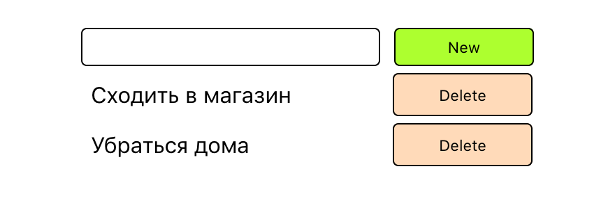

# Мини-приложение: Список дел



Создадим подпапку `todo` внутри `src`, а в ней — файл `TodoApp.jsx`:

```jsx
import React, { useState } from 'react';

export function TodoApp() {  

  return (
    <div >

    </div>
  );
}
```

Во избежание путаницы, называй компоненты и содержащие их файлы одинаково.

Не забудь импортировать `TodoApp` в `App.jsx`. Попытайся сделать это самостоятельно. Если возникли сложности, обратись к прошлому уроку.

Давай посмотрим, на какие компоненты можно разделить наше приложение:

* Строка ввода нового дела
  * Поле для ввода нового дела
  * Кнопка добавления
* Элемент списка дел
  * Текст дела
  * Кнопка удаления

Так как элементов списка дел может быть сколько угодно, для нас очень удобно иметь такой компонент, который мы можем переиспользовать сколько угодно раз.

