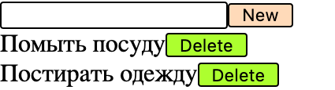
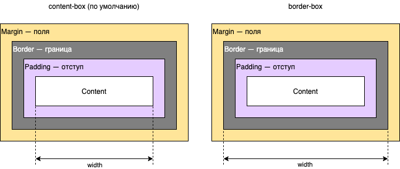

# CSS: Наводим красоту

## Основы CSS

Каждому элементу на странице можно присвоить определенный _класс_. Классы служат для того, чтобы задавать элементам внешний вид. Пример: 

```jsx
<button class="button red">Hello</button>
// В JSX вместо атрибута class мы используем атрибут className
```

Теперь в CSS мы можем задать стиль кнопки: 

```css
.button {
  width: 100px; /*ширина*/
  padding: 6px; /*внутренний отступ от границы*/
}

.red {
  background-color: red; /*цвет фона*/
  color: white; /*цвет текста*/
}
```

Так как наша кнопка использует оба класса, будут применены стили из `.button` и из `.red`. Если мы хотим задать стили только для тех элементов, которые используют оба класса сразу, то мы напишем такое правило:

```css
.button.red {
   /*...*/
}
```

Мы также можем задавать правила, использующие иерархию элементов. Например, есть у нас такой HTML

```markup
<span class="a item">      <!--1-->
  <div class="b item">     <!--2-->
    <span class="c item">  <!--3-->
    </span>
  </div>
</span>
```

Посмотрим, как можно использовать CSS селекторы для выбора элементов:

| CSS селектор | Значение | Результат |
| :--- | :--- | :---: |
| `span` | Тег `<span>` | 1, 3 |
| `div.c` | Тег `<div>` с классом `c`  | — |
| `.item` | Элемент с классом `item`  | 1, 2, 3 |
| `.a > .b` | Элемент с классом `b` — непосредственный потомок элемента с классом `a` | 2 |
| `.a > .item` | Элемент с классом `item` — непосредственный потомок элемента с классом `a` | 2 |
| `.a .item` | Элемент с классом `item` — потомок элемента с классом `a` | 2, 3 |
| `.a.item` | Элемент с классами `a` и `item` | 1 |
| `.a .c.item` | Элемент с классами `c` и `item` — потомок элемента с классом `a` | 3 |
| `div, span.c` | Два селектора, перечисленные через запятую — правило применится к обоим | 2, 3 |

Это далеко не все возможности CSS, но пока этого достаточно.

## Применение

Давай еще раз посмотрим на то, что должно в конце получиться и составим список "черт" элементов:


1. поле ввода и кнопки имеют **черную обводку с закруглением**
2. кнопка в поле ввода **зеленого** цвета
3. кнопка в списке – **персикового**
4. в каждой строке есть два столбца, пусть **200px** и **100px** соответственно, между ними **10px**
5. вертикальное расстояние между строками  — **5px**
6. у каждого элемента отступ от границы — **6px**

Давай добавим классы нашим компонентам так, чтобы можно было использовать их в CSS:




```jsx
export function TodoApp() {
  //...
  return (
    <div className="todo">
  //...
```





```jsx
export function Field(props) {
  //...
  return (
    <div className="field">
  //...
```





```jsx
export function Item(props) {
  return (
    <div className="item">
    //...
```




В папке `todo` создадим файл `style.css`, а в `TodoApp.jsx`  — импортируем его:


```jsx
import './style.css';
```


Опишем цвета фона наших кнопок \(я использовал ключевые слова для цветов, можешь выбрать [самостоятельно](https://developer.mozilla.org/ru/docs/Web/CSS/color_value#Ключевые_цвета)\):


```css
.field > button {
  background: peachpuff;
}

.item > button {
  background: greenyellow;
}
```


Наши кнопки и поле ввода должны иметь черную обводку с закруглением:


```css
button,
input {
  border: 1px solid black; /*толщина стиль цвет*/
  border-radius: 2px; /*радиус закругления*/
}
```


Стиль бывает `solid`, `dashed`, `dotted` — сплошной, пунктирный и точечками соответственно. попробуй поменять эти значения \(толщины границы, её стиля, цвета и радиуса закругления \) и посмотри, что получится.

На данный момент результат должен быть похож на это: 



Выглядит не очень хорошо, но мы на верном пути. Осталось выровнять элементы.

Каждая строка состоит из двух элементов: текста/текстового поля \(слева\) и кнопки \(справа\)

Давай назначим этим элементам классы:


```jsx
 return (
    <div className="field">
      <input className="left" type="text" value={text} onChange={onInputChange} />
      <button className="right" onClick={onButtonClick}>New</button>
    </div>
  );
```


Для `Item.jsx` сделай это самостоятельно.

Вернемся в файл стилей:


```css
.left {
  display: inline-block;
  box-sizing: border-box;
  width: 200px;
}
.right {
  display: inline-block;
  box-sizing: border-box;
  width: 100px;
}
```


**Дополнительная информация:** `box-sizing: border-box;` — говорит нам о том, что границу надо учитывать при рассчете ширины компонента:



`display: inline-block;` ****говорит о том, что к элементу надо относиться как к **блоку \(а не как к \)**

## Ответ для прошлой главы


```jsx
function onButtonClick() {
  
  if(text !== ''){ // работаем, только если строка не пустая!
    props.onAdd(text);
    setText('') // просто делаем текст пустой строчкой!
  }
  
}
```



