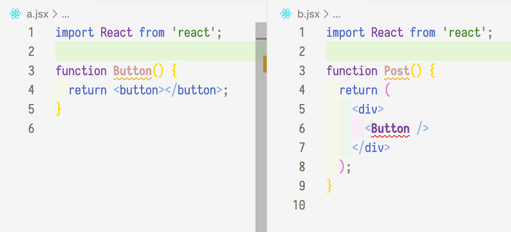

# Импорт и экспорт

## Именованный импорт

Представь себе, что у тебя есть какой-то компонент, который ты хочешь использовать в двух других компонентах. Каждый компонент находится в своем файле:



Если мы хотим использовать этот компонент в каком-то другом файле, его надо **экспортировать**, приписав в начале определения ключевое слово `export`:

```jsx
export function Button() {
  return <button></button>;
}
```

А в месте, где нужно использовать этот компонент, мы его **импортируем**:

```jsx
import { Button } from './a';
```

Та же самая механика экспорта/импорта относится и к переменным, и к функциям, \(строго говоря, функция — это вид переменной\) которые не являются реакт-компонентами. Это не единственный способ, но его вполне достаточно.

## **Дополнительная информация**

Кроме именованного импорта есть еще два вида импортов: Default и Namespace. Их необязательно использовать \(мало того, у  default-импорта есть противники!\).

### Default-импорт

В дальнейшем ты много раз будешь встречать такую строчку:

```jsx
import React from 'react';
```

Как видишь, тут нет фигурных скобок. Отсутствие их означает, что какая-то переменная \(или функция\) была экспортирована с ключевым словом `export default` . Обычно таким методом пользуются создатели библиотек \(таких, как React\), чтобы обозначить какое-то значение как "главное". Кстати, при дефолтном импорте мы можем выбрать какое угодно имя для импортируемой переменной.

### Namespace-импорт

В переводе с английского namespace — "пространство имен". Что это означает? 

Допустим, у тебя есть два компонента, каждый из них экспортирует 

* компонент с именем "Button"
* переменную с именем info:

```jsx
export function Button () {/.../}
export const info = "Информация";
```

Ты хочешь использовать их в третьем компоненте

```jsx
import {Button, info} from './a'
import {Button, info} from './b'
```

Но — о нет! — у тебя образовалась коллизия имен, то есть две разных переменных с одним и тем же именем. Чтобы избежать такой ситуации, ты создаешь пространство имен для каждого импорта:

```jsx
import * as A from './a'
import * as B from './b'

A.Button // кнопка из А
B.info // переменная из B
```

Такой способ подходит для тех случаев, когда импортируется много переменных, если же нужно разрешить всего один конфликт, можно использовать именованный импорт таким образом:

```jsx
import {Button as ButtonA} from './a'
import {Button as ButtonB} from './b'
```

