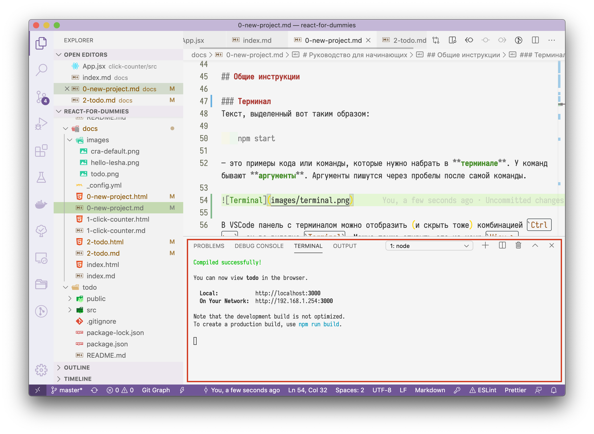

# Терминал

Очень часто в руководстве ты встретишь вот такой блок:

```text
npm start
```

Текст, выделенный вот таким образом — это примеры кода или команды, которые нужно набрать в **терминале**. У команд бывают **аргументы** \(`npm` — это команда, `start` — аргумент\). Аргументы пишутся через пробелы после самой команды.



В VSCode панель с терминалом можно отобразить \(и скрыть тоже\) комбинацией `Ctrl + ~`, он во вкладке `Terminal`. Можно также открыть его из меню `View > Terminal`. Панель с терминалом можно делать выше или ниже, таская мышкой за верхнюю границу. Я рекомендую держать ее открытой, чтоб там умещалось хотя бы 5-10 строк текста. Так у нас будет возможность сразу видеть все проблемы, которые возникают при сборке.

#### Навигация по файловой системе из консоли

Для перехода между папками существует команда `cd` \(Сокращение от "**c**hange **d**irectory"\).

Допустим, у нас есть следующее дерево папок:

```text
C:
└─ Users
   └─ username
      └─ Desktop
         └─ hello-world
```

Откроем терминал. Слева от моргающего курсора будет написан путь к текущей папке. Эта строка, кстати говоря, называется _приглашением терминала_, то есть он ожидает от нас какого-то ввода, какой-то команды.

```text
C:\Users\username\>_ 
```

Сейчас мы находимся в "домашней" папке нашего аккаунта. Мусорить там плохо, поэтому перейдем на рабочий стол, набрав в терминале

```text
cd Desktop
```

и нажав `Enter`:

```text
C:\Users\username\>cd Desktop
C:\Users\username\Desktop\>_ 
```

Это должно сработать даже на русскоязычной Windows, где папка называется "Рабочий стол"

**Примечание для пользователей OneDrive**: Пользователи OneDrive в Windows могут к своему удивлению обнаружить, что папки "Рабочий стол" \("Desktop"\) нет в домашней папке. Обычно, она находится внутри папки OneDrive:

```text
    C:\Users\username\> cd OneDrive
    C:\Users\username\OneDrive> cd Desktop
    C:\Users\username\OneDrive\Desktop>_
```

`cd ..` — выполняет переход на папку выше:

```text
C:\Users\username\Desktop\>cd ..
C:\Users\username\>_
```

В любой момент можно посмотреть, какие файлы присутствуют в текущей папке командой `dir` \(Windows\) или `ls` \(Windows/Linux/OSX\)

