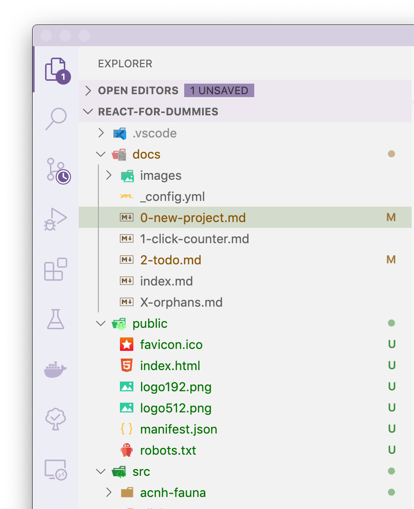

# Работа с файлами в VSCode

У левого края окна есть панель с иконками, которые переключают режимы боковой панели. Одна из них — `Explorer`, в ней будут показаны все файлы твоего проекта. Для создания нового файла или папки тебе надо кликнуть правой кнопкой мышки по папке, в которой ты хочешь их создать, выбрать New File/Folder и ввести название. Для перемещения файлов просто перетащи их мышкой. Можно выделить сразу несколько файлов, если зажать Shift или Ctrl \(⌘\) — всё как везде. 

