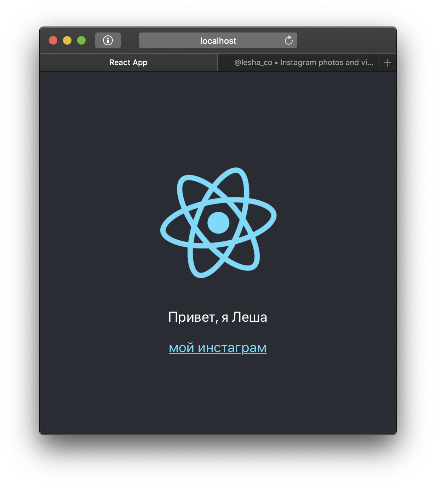

# Создание нового проекта

Для начала давай придумаем, как назвать свое новое приложение. Это должа быть цифробуквенная последовательность без пробелов \(вместо них используй дефисы или подчеркивания\).

В этом примере мы будем создавать приложение `hello-world`, так что во всех местах, где ты видишь это название, мысленно заменяй его на своё.

## Шпаргалка для продолжающих

Если это твой первый проект, пройди в [Руководство для начинающих](new-project.md#rukovodstvo-dlya-nachinayushikh), там подробно описаны все шаги по созданию приложения-заготовеи, а также краткий обзор основных компонентов. Если тебе уже все это знакомо, то здесь представлен краткий список шагов по созданию нового приложения.

1. Открой терминал в VSCode и перейди в папку, где ты хочешь создать проект
2. Используй CRA для создания проекта:

   ```text
    npx create-react-app hello-world
   ```

3. Перейди в папку только что созданного приложения:

   ```text
    cd hello-world
   ```

4. Запусти приложение:

   ```text
    npm start
   ```

5. Откроется браузер, а в терминале должна появиться фраза "Compiled successfully!"
6. Если потерялась вкладка с приложением, в том же терминале есть ссылка, по которой ты найдешь свое приложение
7. Удали все лишнее из приложения \(см. раздел [Очистка заготовки приложения](new-project.md#ochistka-zagotovki-prilozheniya)\)

## Руководство для начинающих

### Создание стартового проекта

Мы используем пакет `create-react-app` \(далее — `CRA`\) для создания базы нашего приложения. Первым аргументом CRA принимает имя папки, которую он создаст и в которой он создаст все файлы, необходимые для работы нашего приложения.

```text
npx create-react-app hello-world
```

Процесс займет пару минут, можно пока пойти налить чай.

Когда CRA закончил работать, мы можем открыть созданный проект. Выбери в меню `File > Open` папку проекта \(`hello-world` на рабочем столе\).

Слева в интерфейсе должно появиться дерево папок. Найди в нем файл `src/App.js` и переименуй в `App.jsx` \(`правая кнопка > Rename`\)

### Запуск стартового проекта

Вернемся обратно в терминал. Нам нужно выполнить команду `npm start` для запуска приложения, но для этого нам нужно _быть_ в папке приложения. Если мы сейчас в папке рабочего стола, то можно набрать

```text
cd hello-world
```

и нажать `Enter`. Если же мы находися в папке аккаунта \(`C:\Users\<username>`\), то надо сначала попасть на рабочий стол, как мы это делали выше.

Теперь, в папке проекта, мы можем выполнить

```text
npm start
```

Должен открыться браузер. Если то, что ты видишь в браузере, выглядит так, как на картинке, то мои поздравления!


### Обзор основных файлов

Время посмотреть, как работает наше приложение. У нас в проекте достаточно много файлов, но на данный момент нас интересуют всего три:

#### `public/index.html`

Это уже большой файл, но по большей части там только `<!-- комментарии -->`. Редактировать его мы будем нечасто \(если вообще будем\), но здесь есть одно интересное место. У меня это 31 строка:

```text
<div id="root"></div>
```

Держи это место в уме следующие несколько минут.

#### `src/index.js`

Этот файл мы тоже не будем трогать \(На самом деле будем, но единожды\), но он — то, с чего начинается наше приложение.

Здесь нас интересует вот такая конструкция:

```jsx
ReactDOM.render(
  <React.StrictMode>
    <App />
  </React.StrictMode>,
  document.getElementById('root')
);
```

**Краткая информация:** здесь мы отдаем инструкцию отобразить `<App/>` \(следующий пункт\) внутри `<div id="root"></div>` \(прошлый пункт\).

**Полная информация:** Эта конструкция связывает корень нашего приложения \(`App.jsx`\) и HTML-документ. 

Эта информация дана для более глубокого понимания принципа работы приложения. Если ты находишь ее трудной для понимания, смело пропускай этот пункт. 

Давай разберем ее по частям:

`ReactDOM.render()` — функция, которая отрисовывает указанное дерево React-компонентов в определенном месте веб-страницы. Этот кусок кода — это и есть "дерево React-компонентов":

```text
 <React.StrictMode>
   <App />
 </React.StrictMode>
```

Все, что тебе надо знать про `React.StrictMode` - то, что это невидимый компонент, который "активирует дополнительные проверки и предупреждения для своих потомков". А потомок тут только один: `<App/>` — это как раз все наше приложение \(о нём ниже\).

`document.getElementById('root')` — функция, которая достает из HTML-документа элемент с указанным ID \(в данном случае `'root'`\). Это тот самый  `<div id="root"></div>` из прошлого пункта. 

#### `src/App.jsx`

Это "корень" нашего приложения. Здесь ты можешь видеть стандартные для HTML теги `<p>`, `<a>`, `<div>` и другие. Вместе с HTML-тегами можно использовать JSX-теги, которые вставляют в твой документ Реактовские компоненты \(такие же, как сам `<App/>`\). Правило простое: если тег начинается со строчной буквы — это HTML-тег, если с заглавной — React-компонент.

**Задание**: Пока же давай экспериментировать. Поменяем текст внутри блока `<p>` на какое-нибудь приветствие. Потом поменяем ссылку и текст в `<a>` на ссылку своего профиля в соцсеточке. Сделав это, нажми `Ctrl+S` для сохранения файла. Страничка в браузере должна перезагрузиться сама \(благодаря некоторой _магии_\).



**Если страница в браузере была закрыта**, открой терминал в VSCode, там должна быть ссылка на приложение:

```text
Compiled successfully!

You can now view hello-world in the browser.

  Local:            http://localhost:3000            <-- вот эта ссылка
  On Your Network:  http://192.168.1.254:3000

Note that the development build is not optimized.
To create a production build, use npm run build.
```

В этой же консоли будут отображаться все ошибки, которые возникнут при сборке приложения

### Очистка заготовки приложения

**Внимание!** Не забывай сохранять файлы после каждого изменения

Откроем файл `src/App.jsx` и удалим все внутри `<div className="App">`, а также строку с импортом лого \(`import logo ...`\) Функция `App` должна принять такой вид:

```jsx
import React from "react";
import "./App.css";

function App() {
  return (
    <div className="App">

    </div>
  );
}
```

Откроем `src/App.css` и удалим все его содержимое. Эти стили нужны были для демо-страницы, больше они не пригодятся.

**\(опционально\)** Из папки `src` можно удалить файлы:

* App.test.js
* logo.svg
* setupTests.js

**\(опционально\)** Удали файл `src/serviceWorker.js`, а в файле `src/index.js` удали строчки \(они в разных концах файла\)

```javascript
import * as serviceWorker from './serviceWorker';
serviceWorker.unregister();
```

